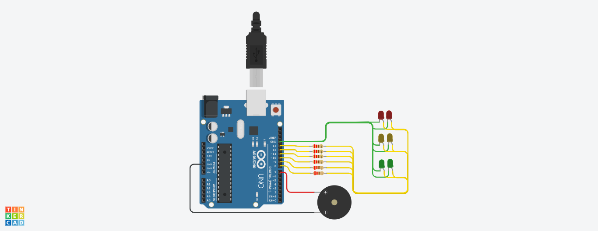
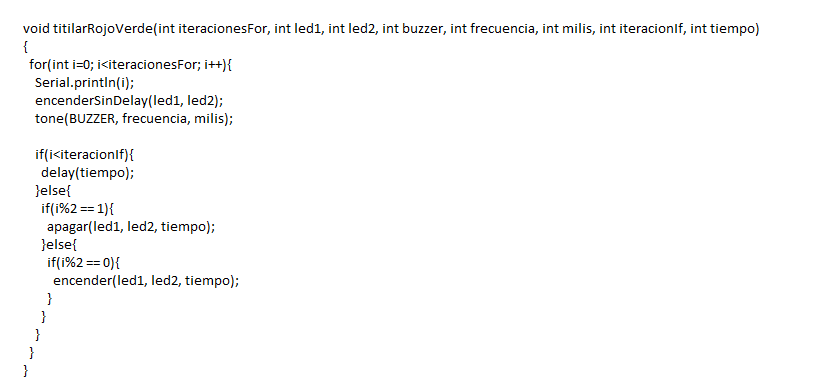

# Integrantes

- Barbizan	Franco.
- García	Angeles Belen 
- Dopiralski	martin
- Costantini	Nicolas
- Espinoza	Fernando
- Fernández	Agustín

# Proyecto: Semafaro para no videntes.

# Descripción
Se desarrollo un semáforo para personas no videntes, que al estar en rojo emite una señal sonora para dar la advertencia de no cruzar. Al estar en amarillo el tono de la señal de advertencia cambia. Cuando es verde no suena dicha señal dándole a entender al peatón que puede cruzar.
En simultaneo, durante el tiempo que tanto leds rojas como amarillas estan encendidas, las mismas se encuentran titilando.   

# Función principal

Esta funcion hace que suene el buzzer y titilen los leds ROJOS o VERDES segun las iteraciones, los milisegundos del Buzzer y el tiempo de delay. (en caso del VERDE, hay que ingresar "0" a la frecuencia para que no suene).
Recibe 8 parametros:
-cantidad de iteraciones en el "for"
-primer led - segundo led
-pin del buzzer
-frecuencia del tono del buzzer
-milisegundos del buzzer
-iteracion que le das al "if" para titilar las leds
-tiempo que mantiene el buzzer
-los leds encendidos o apagados

# Link al proyecto 

- Barbizan	Franco : https://www.tinkercad.com/things/5E3J4jxkiRR-dojo-e-ejercicio-2-prototipo-2/editel?sharecode=WoGBVerlX85aI-H6U8h8DyVLLxKHdQa-XrGEwjXtwzk

- García	Angeles Belen : https://www.tinkercad.com/things/kF5q4uobuEr-spd-angeles-belen-garcia-dojo-e-parte-2/editel?sharecode=Gj9gbn6f7O4leR7J86BNBvJUjUDXwQ0c_CCfbnxFVIo

- Dopiralski	martin : https://www.tinkercad.com/things/62ZeCfPxR5e-copy-of-martindopiralski-dojo-11/editel?sharecode=fHA6TBlPePwfwvt6uKrhi-o8y38g3-U8Jv5DRdVO00g

- Costantini	Nicolas : https://www.tinkercad.com/things/gKqJUNhxicJ-dojo-e-nicolas-costantini-ej-2/editel?sharecode=FZlGDAmebU5phcmUJOEQncdPiY9OWsxQcbJdW7ub-j4

- Espinoza	Fernando : https://www.tinkercad.com/things/estin-fernandez-2-5/editel?sharecode=Sg20dfxsCjN2FRNyp5_0iDHWZmPIJbE_-oBjh4fUymo